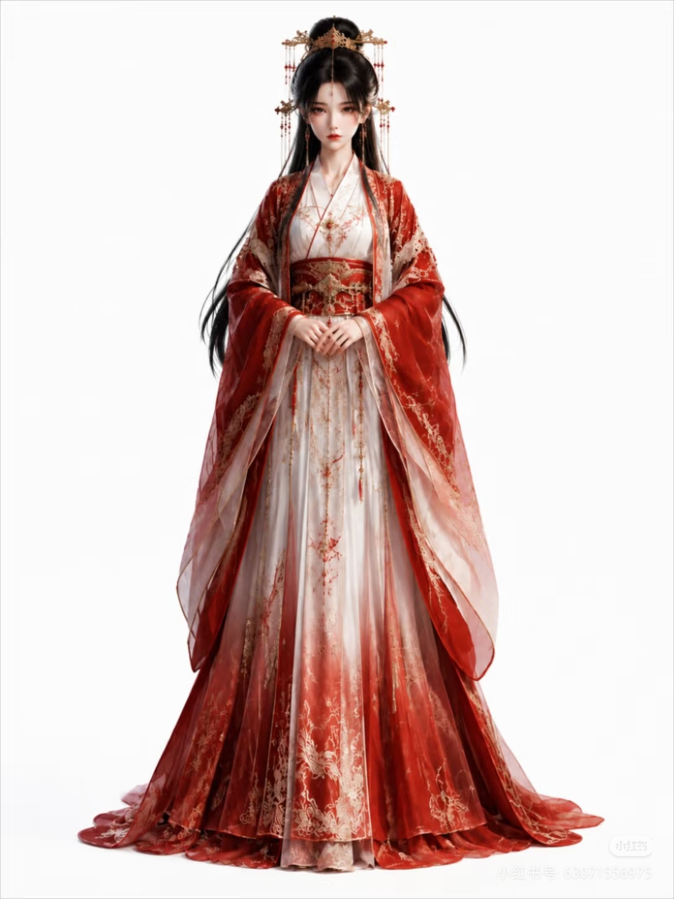
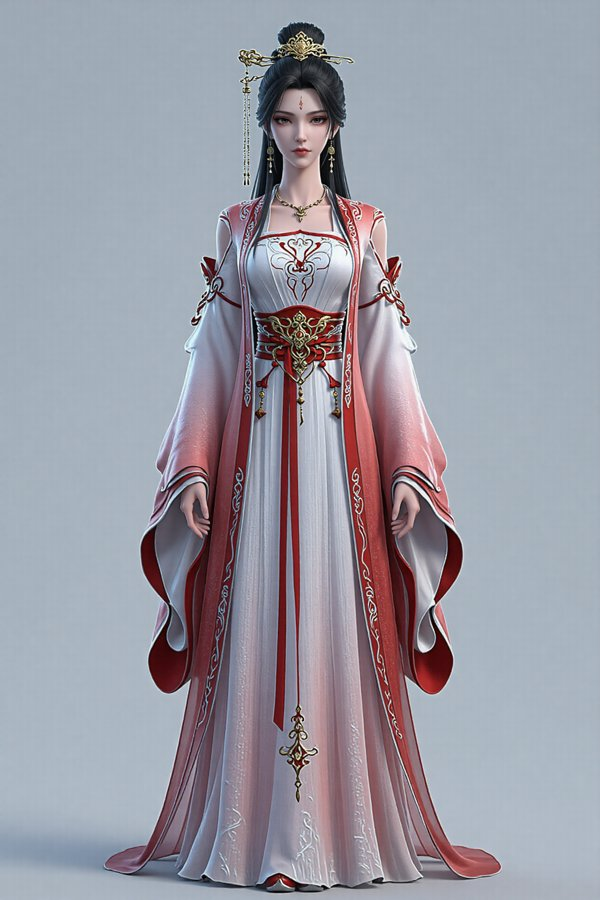

# AI Short Drama Asset Pipeline

> 剧本一键输入 → 人物/场景/道具资产自动生成 → 三层质检 → 自动返工 → HTML报告 → 假设检验对比

全链路自动化的AI短剧资产生成与质量评估管线，支持RunningHub云端ComfyUI工作流调用，内置CUDA GPU加速质检。

## ✨ 核心特性

- 🎬 **全链路自动化**：剧本一键输入，自动完成人物/场景/道具三类资产的解析、生成、质检、返工与报告，无需人工干预
- 👤 **多视角一致性**：基于Qwen-Image-Edit-2511的指令驱动能力，生成同角色正面/侧面/背面多视角统一形象
- 🎨 **双风格切换**：支持亚洲/欧美两套美术风格一键切换，适配都市、古风、悬疑等不同题材剧本
- ⚡ **批量并发调度**：5路异步并发+2小时超时保护，单集剧本资产生成效率提升约70%
- 🔍 **三层质量质检**：IQA画质(BRISQUE/模糊) + CLIP语义对齐 + 专项检测(人体关键点/OCR/场景一致性)，CUDA GPU加速
- 🔄 **自动返工机制**：自动检测人体不完整图片，找到源提示词重新提交生成，覆盖不合格图片并记录返工日志
- 📊 **可视化报告**：人物/道具/场景独立报告 + 综合报告 + 假设检验对比报告，含指标说明和动态优化建议
- 📈 **假设检验对比**：基于曼-惠特尼U检验(Mann-Whitney U)，将新剧本资产与基准值对比，判断批次质量是否达标
- 🎛️ **参数网格调参**：ComfyUI For Loop多参数网格生成(11×11) + Python自动分析头身比/上下半身比/风格距离，根据参考图找到最佳参数组合，输出可交互HTML报告
- 📦 **标准化交付**：自动按命名集分类归档，资产与剧本实体一一对应（如`叶凡的玉佩.jpg`），可直接对接后期剪辑管线

## 📂 模块架构（7个核心模块）

| 模块 | 文件 | 职责 |
|------|------|------|
| 启动器 | `launcher.py` | 一键运行全流程：剧本→生成→质检→返工→报告→假设检验 |
| 资产生成 | `generation.py` | 剧本解析→提示词生成→RunningHub API批量生成图片→合并重命名 |
| 三层质检 | `core_eval.py` | IQA画质 + CLIP语义对齐 + 专项检测(人体关键点/OCR/场景一致性) + 统计学模块 |
| 自动返工 | `rework.py` | 检测人体不完整→找到源提示词→重新提交API生成→覆盖不合格图→记录返工日志 |
| 报告生成 | `reporting.py` | 人物/道具/场景独立报告 + 综合报告，含指标说明和动态结论 |
| 统计分析 | `analysis.py` | 基准值管理 + 曼-惠特尼U检验假设对比 + 假设检验报告生成 |
| 网格调参 | `lora_grid_analysis.py` | 多参数强度网格图批量分析：头身比/上下比/Gram风格距离 + 最佳参数推荐 + 可交互HTML报告 |

## 📁 目录结构

```
ai-short-drama-pipeline/
├── launcher.py              # 启动器（全流程入口）
├── generation.py            # 资产生成模块
├── core_eval.py             # 三层质检模块
├── rework.py                # 自动返工模块
├── reporting.py             # 报告生成模块
├── analysis.py              # 统计分析/假设检验模块
├── lora_grid_analysis.py    # Lora网格调参分析模块
├── workflows/               # ComfyUI工作流JSON
│   ├── prompt_workflow.json # 提示词生成工作流
│   ├── char_workflow.json   # 人物生成工作流
│   ├── prop_workflow.json   # 道具生成工作流
│   ├── scene_workflow.json  # 场景生成工作流
│   └── lora_grid_workflow.json  # Lora双强度网格调参工作流
├── examples/                # 效果示例图
│   ├── char_demo.png
│   ├── scene_demo.png
│   └── prop_demo.png
├── reports/                 # 生成的HTML报告
│   ├── 综合报告_无法言说的秘密_完整版.html
│   ├── 假设检验对比报告_无法言说的秘密_完整版.html
│   └── lora_grid_report.html  # Lora网格调参可视化报告
├── 剧本/                     # 剧本文件（.txt）
├── API密钥.txt               # RunningHub API密钥（不提交到Git）
├── README.md
├── .gitignore
└── LICENSE
```

## 🚀 快速开始

### 1. 安装依赖

```bash
pip install numpy pandas scipy Pillow opencv-python transformers torch brisque ultralytics rapidocr-onnxruntime imagehash insightface
```

> **GPU加速**：如需CUDA加速，安装对应CUDA版本的PyTorch，并将torch库路径通过`PYTHONPATH`环境变量指定。

### 2. 配置API密钥

在项目根目录创建`API密钥.txt`，写入RunningHub API密钥。

### 3. 运行全流程

```bash
# 交互式（选择剧本）
python launcher.py

# 命令行参数（指定剧本和输出目录）
python launcher.py 剧本/无法言说的秘密_第一集.txt RunningHub_Outputs_输出目录
```

### 4. 单独运行各模块

```bash
# 仅资产生成
python generation.py 剧本/xxx.txt 输出目录 1

# 仅质检（需先生成资产）
set EVAL_OUTPUT_DIR=输出目录
python core_eval.py

# 仅生成报告
set EVAL_OUTPUT_DIR=输出目录
python reporting.py
```

## 🎛️ 参数网格调参（以Lora强度为例）

用于系统探索生成参数（如Lora强度、采样步数、CFG Scale、Denoise等）不同组合对人物比例和风格的影响。**核心目标：根据给定参考图，找到符合要求的最佳参数组合**，包括风格匹配度、头身比、上下半身比例等关键指标。

本章节以**双Lora强度网格**为示例（"完美世界国漫风" + "国漫CG"），工作流和分析脚本同样适用于其他参数的网格调参。

### 工作流生成（ComfyUI）

使用 `workflows/lora_grid_workflow.json`，基于For Loop Start/End节点实现双参数强度网格：
- X轴：参数A强度（0~1.0，间隔0.1，共11档，示例为Lora A）
- Y轴：参数B强度（0~1.0，间隔0.1，共11档，示例为Lora B）
- 总计 11×11 = 121张图，自动打包为ZIP输出

### 分析脚本使用

```bash
# 1. 将121张网格图放入图片目录（默认 lora_grid_images/）
# 2. 运行分析
python lora_grid_analysis.py
```

脚本会自动完成：
1. **第一遍统计**：计算所有图的 `hair_ratio`（头发区域占脸高比例）均值，推导全局固定补偿值
2. **第二遍分析**：统一用固定补偿计算每张图的头身比、上下半身比
3. **风格距离**：VGG16 Gram矩阵计算每张图与参考风格的距离
4. **最佳参数推荐**：综合评分最高的参数组合自动标注
5. **输出报告**：可交互HTML + CSV数据表

### 头身比计算原理

```
脸高 = 人脸框底 - 人脸框顶
头发比 hair_ratio = (人脸框顶 - 人体框顶) / 脸高
固定补偿 = min(0.25, hair_ratio均值 × 0.5)
头顶线 = 人脸框顶 - 固定补偿 × 脸高
下巴线 = Anime Face Detector 28关键点中的点2（真实检测）
身高底 = max(脚踝点y, 人体框底y)   ← 裙子遮脚踝时自动用框底兜底
头长 = 下巴线 - 头顶线
身高 = 身高底 - 头顶线
头身比 = 身高 / 头长
```

### 分析指标

| 指标 | 说明 | 目标值 |
|------|------|--------|
| `head_body_ratio` | 头身比（身高/头长） | 8.0 ~ 9.0 |
| `upper_lower_ratio` | 上下半身比例（下半身/上半身） | 1.35 ~ 1.5 |
| `gram_style_distance` | Gram矩阵风格距离（与参考风格，越小越接近） | 越低越好 |
| `composite_score` | 综合评分（风格0.3+头身比0.3+上下比0.2+完整性0.2） | 越高越好 |

### 报告功能

- **11×11可点击网格**：点击任意图片放大查看
- **灯箱键盘导航**：↑↓纵向切行，←→横向切列，ESC关闭
- **4张热力图**：头身比、上下比、Gram距离、综合评分
- **完整数据表**：121行全量数据，头身比≥8.0标绿、<6.0标红
- **参数推荐**：自动找出综合评分最高的参数组合

### 报告输出

网格调参生成三份产物：

1. **[完整分析报告](https://htmlpreview.github.io/?https://github.com/zyourong/ai-short-drama-pipeline/blob/master/reports/lora_grid_report.html)** — 含总览统计、11×11图片网格、4张热力图（头身比/上下比/Gram距离/综合评分）、最佳参数推荐
2. **[11×11图片网格（独立版）](https://htmlpreview.github.io/?https://github.com/zyourong/ai-short-drama-pipeline/blob/master/reports/lora_grid_images.html)** — 纯图片网格，点击放大、↑↓纵向切行、←→横向切列、ESC关闭
3. **[参考图 → 最佳参数图 对比](https://htmlpreview.github.io/?https://github.com/zyourong/ai-short-drama-pipeline/blob/master/examples/reference_to_best.html)** — 风格参考图与最佳参数生成图（pw=0.6, cg=0.5）并排对比，含各项指标

| 风格参考图 | 最佳参数生成图 |
|:---:|:---:|
|  |  |
| 风格匹配基准 | pw=0.6, cg=0.5（综合评分0.8162） |

> 综合评分权重：Gram风格距离 0.8（主要目标）+ 人体完整性 0.08 + 头身比 0.07 + 上下半身比 0.05

## 🔍 质检指标说明

### 通用指标（所有资产）
| 指标 | 说明 | 合格标准 |
|------|------|----------|
| `brisque_score` | 无参考画质评分（越低越好） | **< 45** |
| `blur_score` | 拉普拉斯模糊检测（越高越清晰） | **> 50** |
| `iqa_pass` | 画质是否合格 | brisque<45 **且** blur>50 |
| `clip_score` | CLIP图文匹配度 | **≥ 0.26** |
| `clip_pass` | CLIP语义是否合格 | clip_score ≥ 0.26 |

### 人物专属
| 指标 | 说明 | 合格标准 |
|------|------|----------|
| `keypoint_count` | YOLOv8-pose人体关键点数量 | **= 17**（必须完整） |
| `integrity_pass` | 人体完整性是否合格 | keypoint_count == 17 |
| `intra_clip_consistency` | 1×4横排多视角CLIP一致性 | **≥ 0.70** |
| `intra_face_consistency` | InsightFace人脸一致性（需下载模型） | **≥ 0.72** |

### 道具专属
| 指标 | 说明 | 合格标准 |
|------|------|----------|
| `has_text` | 是否检测到文字 | —（信息项） |
| `detected_text` | OCR识别的文字内容 | —（信息项） |
| `text_lang_pass` | 文字语种校验 | 亚洲风格：中文占比 **≥ 30%**；欧美风格：英文占比 **≥ 50%** |
| `text_keyword_pass` | 关键词校验 | 包含核心关键词即合格 |
| `text_pass` | 文字综合是否合格 | text_lang_pass **且** text_keyword_pass |

### 场景专属
| 指标 | 说明 | 合格标准 |
|------|------|----------|
| `group_consistency` | 四宫格2×2多视图CLIP一致性 | **≥ 0.65** |
| `scene_color_consistency` | HSV直方图颜色一致性 | **≥ 0.40**（四视图内容差异大，0.70过严） |

## 📈 假设检验

基于曼-惠特尼U检验(Mann-Whitney U test, 双侧, α=0.05)，将新剧本资产的各项指标与基准值对比：
- **p > 0.05**：新批次与基准无显著差异，质量达标
- **p ≤ 0.05**：新批次与基准存在显著差异，需关注

基准值目录默认为`RunningHub_Outputs/`，可在`launcher.py`中配置`BASELINE_DIR`。

## ⚙️ 环境变量

| 变量 | 说明 |
|------|------|
| `EVAL_OUTPUT_DIR` | 质检/报告的输出目录 |
| `PYTHONPATH` | GPU torch库路径（如`./pylibs`） |
| `HF_ENDPOINT` | HuggingFace镜像（国内加速，如`https://hf-mirror.com`） |

## 📸 效果示例

### 人物多视角一致性生成
基于Qwen-Image-Edit-2511，输入同一角色参考图，自动生成正面、侧面、背面三视图，保持身份特征与画风统一。


### 场景生成
支持新中式/欧美双风格场景生成，并可根据剧本场景描述控制日夜光影变化。


### 道具生成
标准化白底45°视角道具图，可直接用于后期合成与排版。


## 📊 质量评估报告示例

基于「无法言说的秘密」完整版剧本（137张图：13人物 + 97道具 + 27场景）的全流程质检结果：

- **[综合质量评估报告](https://htmlpreview.github.io/?https://github.com/zyourong/ai-short-drama-pipeline/blob/master/reports/综合报告_无法言说的秘密_完整版.html)** — 人物/道具/场景三类资产的完整质检结果，含合格率统计、散点图分布、综合结论与优化建议
- **[假设检验对比报告](https://htmlpreview.github.io/?https://github.com/zyourong/ai-short-drama-pipeline/blob/master/reports/假设检验对比报告_无法言说的秘密_完整版.html)** — 新剧本资产与历史基准值的曼-惠特尼U检验对比，12项指标自动判断批次质量是否达标
- **[参数网格调参 · 完整分析报告](https://htmlpreview.github.io/?https://github.com/zyourong/ai-short-drama-pipeline/blob/master/reports/lora_grid_report.html)** — 双Lora强度11×11网格调参可视化，含头身比/上下比/Gram距离/综合评分4张热力图、可点击图片网格，自动推荐最佳参数（Gram权重0.8）
- **[参数网格调参 · 11×11图片网格（独立版）](https://htmlpreview.github.io/?https://github.com/zyourong/ai-short-drama-pipeline/blob/master/reports/lora_grid_images.html)** — 纯图片网格浏览，121张全量图，点击放大、↑↓纵向切行、←→横向切列、ESC关闭
- **[参数网格调参 · 参考图→最佳参数图对比](https://htmlpreview.github.io/?https://github.com/zyourong/ai-short-drama-pipeline/blob/master/examples/reference_to_best.html)** — 风格参考图与最佳参数生成图（pw=0.6, cg=0.5）并排对比，含Gram距离/头身比/上下比等指标

## 📄 License

MIT License
